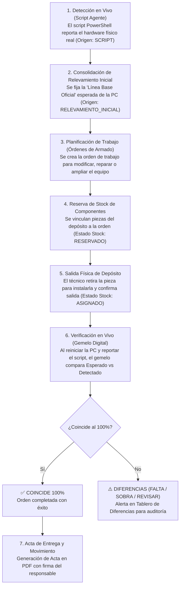

# 🏛️ Arquitectura Visual y Funcional: Modern Guided Card-Based Admin Shell
**Proyecto:** Inventario Modular  
**Poder Judicial de Jujuy - Centro Judicial San Pedro**  
**Fecha de Documentación:** 03 de Septiembre de 2026  

---

## 1. 🎯 Visión General y Propósito

El sistema de **Inventario Modular** resuelve la gestión física y lógica del parque informático mediante el concepto de **Gemelo Digital** (*Digital Twin*).

Para evitar que las pantallas administrativas se conviertan en formularios infinitos, confusos y sin un orden aparente, se diseñó e implementó la arquitectura visual **Modern Guided Card-Based Admin Shell**. Esta arquitectura transforma pantallas tradicionales en un **circuito guiado paso a paso**, donde el usuario siempre comprende:
1. **En qué estado está el equipo actualmente.**
2. **Qué acción acaba de realizar y qué resultado produjo.**
3. **Cuál es el siguiente paso natural a seguir.**

---

## 2. 🔄 El Circuito Operativo Natural (Flujo de Negocio)

El ciclo de vida de un equipo informático dentro del sistema sigue una secuencia lógica estandarizada:

---

## 3. 🎨 Arquitectura Visual: Componentes y Estándares

Toda la interfaz visual se construye sobre Vanilla CSS optimizado en `src/main/resources/static/css/admin.css` utilizando variables y componentes modulares:

### 3.1. Workflow Stepper (`.workflow-stepper`, `.workflow-step`)
- **Propósito:** Mostrar de un solo vistazo el progreso en el circuito operativo.
- **Estados:**
  - `.is-current`: Paso activo que requiere la atención inmediata del usuario (borde primario con sombra azul suave).
  - `.is-done`: Paso completado satisfactoriamente (indicadores verdes y badges autorizados).
- **Estructura Interna:**
  - `.step-header`: Contiene el número `.step-badge` y el estado `.authorization-badge`.
  - `.step-title`: Nombre conciso del paso.
  - `.step-desc`: Breve texto que explica qué significa este paso.
  - `.step-action-area`: Botón de acción rápida conmutador o enlace directo.

### 3.2. Banner de Siguientes Pasos (`.workflow-banner`)
- **Propósito:** Aparece tras realizar una acción clave (ej. consolidar el relevamiento inicial o registrar una orden de armado).
- **Función:** Elimina la sensación de "¿y ahora qué hago?" ofreciendo botones directos a las 2 acciones inmediatamente siguientes (`.workflow-next-actions`).

### 3.3. Pestañas de Navegación Limpia (`.subnav-tabs`, `.subnav-tab`, `.tab-pane`)
- **Propósito:** Evitar el scroll infinito y reducir la fatiga cognitiva.
- **Comportamiento:**
  - Navegación instantánea mediante script liviano Vanilla JS (`switchTab('id')`).
  - Compatible con historial y anclas de URL (`#tab-gemelo`, `#tab-ordenes`, `#tab-editar`, etc.).
  - Cumplimiento de accesibilidad (`role="tab"`, `role="tabpanel"`, `aria-selected`, `aria-controls`).

### 3.4. Grilla de Tarjetas de Hardware (`.attribute-card-grid`, `.attribute-card`)
- **Propósito:** Visualizar la ficha técnica de un equipo dividida en 4 tarjetas compactas:
  1. *Identidad y Red:* Hostname, IP, MAC, Fuero, Ubicación, Usuario asignado.
  2. *Sistema y Procesador:* Sistema Operativo, Arquitectura, CPU, Motherboard.
  3. *Memoria y Almacenamiento:* RAM total, Bancos ocupados, Discos rígidos/SSD con seriales.
  4. *Periféricos y Dispositivos:* Monitores, Teclado, Mouse, Impresora.

### 3.5. Barra de Acciones Rápidas (`.quick-nav-bar`)
- **Propósito:** Barra superior contextual con enlaces cruzados directos:
  - Volver al listado general.
  - Ficha y Gemelo Digital del equipo activo.
  - Acceso al Stock de componentes.
  - Acceso al Tablero General de Diferencias.
  - Historial de Auditoría y Movimientos.

### 3.6. Tarjetas Métricas Interactivas (`.metric-card`)
- **Propósito:** Reemplazar contadores estáticos o tablas frías por tarjetas KPI de alto impacto visual e interactividad directa (tal como en el Tablero de Diferencias, Catálogo de Equipos y Gestión de Stock).
- **Estructura y Estilos:**
  - Borde lateral de color temático: `.border-blue` (totales), `.border-green` (conformes/disponibles), `.border-yellow` (pendientes/reservados), `.border-orange` (taller/instalados), `.border-red` (faltantes/alertas).
  - Título en mayúsculas sobrias (`.metric-card-title`), valor numérico en tipografía grande y negrita (`.metric-card-value`).
  - Pie interactivo (`.metric-card-action`) con flecha `➜` que actúa como filtro instantáneo o salto de contexto.
  - Micro-animación en hover (elevación sutil `translateY(-2px)` y sombra `0 4px 12px rgba(0,0,0,0.08)`).
  - Estado activo (`.is-active`) para indicar qué filtro se encuentra actualmente aplicado en la vista.

---

## 4. 📂 Mapeo de Archivos y Responsabilidades

| Componente | Archivo Fuente | Descripción |
| :--- | :--- | :--- |
| **Controlador de Equipos** | `ar.gov...web.EquipoPageController.java` | Prepara el modelo de detalle con banderas de relevamiento inicial, conteo de órdenes activas y diferencias del gemelo digital. |
| **Controlador de Armado** | `ar.gov...web.OrdenArmadoPageController.java` | Gestiona el ciclo de vida de las órdenes de ensamble, reserva de piezas de stock (`RESERVADO`) y confirmación física (`ASIGNADO`). |
| **Controlador de Auditoría** | `ar.gov...auditoria.MovimientoEquipoController.java` | Registra traslados de equipos y genera actas de entrega/devolución en formato PDF imprimible. |
| **Servicio de Actas PDF** | `ar.gov...actas.ActaPdfService.java` | Genera actas oficiales en PDF mediante Flying Saucer y plantilla XHTML formal con membrete del Poder Judicial de Jujuy. |
| **Servicio de Gemelo Digital** | `ar.gov...componentes.GemeloDigitalService.java` | Compara componentes esperados vs componentes detectados por el script para calcular discrepancias (`COINCIDE`, `FALTA`, `SOBRA`, `REVISAR`). |
| **Estilos CSS Globales** | `src/main/resources/static/css/admin.css` | Contiene todas las definiciones para steppers, banners, pestañas, tablas responsivas, tarjetas y líneas de tiempo (`.audit-timeline`). |
| **Plantilla Detalle Equipo** | `src/main/resources/templates/admin/equipo-detalle.html` | Pantalla principal del equipo con stepper de 3 pasos y 4 pestañas interactivas. |
| **Plantilla Órdenes Armado** | `src/main/resources/templates/admin/ordenes-armado.html` | Pantalla de órdenes y ensamble con stepper de 4 pasos y 3 pestañas. |
| **Plantilla Stock Depósito** | `src/main/resources/templates/admin/stock.html` | Pantalla de almacén de repuestos con stepper de 4 pasos (Ingreso, Depósito, Reserva, Asignación). |
| **Plantilla Tablero Diferencias** | `src/main/resources/templates/admin/dashboard-diferencias.html` | Matriz de discrepancias de hardware con botones directos para subsanar faltantes y auditar gemelos. |
| **Plantilla Auditoría Equipo** | `src/main/resources/templates/admin/equipo-auditoria.html` | Bitácora de trazabilidad con selector de vista dual (Tabla y Línea de Tiempo). |
| **Plantilla Acta Institucional PDF** | `src/main/resources/templates/pdf/acta-institucional.html` | Plantilla oficial en XHTML para renderizado con Flying Saucer con membrete, firmas y resguardo legal. |
| **Plantilla Listado Equipos** | `src/main/resources/templates/admin/equipos.html` | Listado general con accesos rápidos `[🔍 Gemelo]` y `[🛠️ Órdenes]`. |

---

## 5. ✅ Hitos Completados en la Bitácora de Trabajo

1. **Tablero de Diferencias y Resolución Inmediata (`/admin/dashboard-diferencias`):**
   - **Acción directa por discrepancia:** Cada fila de equipo cuenta ahora con botones de resolución rápida:
     - `🛠️ Crear Orden de Armado`: Navega a `/admin/ordenes-armado?equipoId={id}`, preseleccionando la PC automáticamente en el formulario técnico para asignar piezas de inmediato.
     - `🤖 Auditar Gemelo Digital`: Navega a `/admin/equipos/{id}#tab-gemelo`, activando directamente la pestaña del gemelo digital.
     - `📜 Historial de Movimientos`: Acceso directo a la bitácora del equipo.
   - **Identificación cromática de alertas:** Badges y bloques diferenciados para `FALTA` (alerta roja), `SOBRA` (alerta naranja) y `REVISAR` (alerta amarilla).
   - **Métricas interactivas:** Tarjetas superiores con filtrado directo en un solo clic.

2. **Stepper Unificado de 4 Pasos en Pantalla de Stock (`/admin/stock`):**
   - Implementación del componente `.workflow-stepper` para reflejar el ciclo de vida del hardware de taller:
     - *Paso 1 (Ingreso y Recepción):* Alta en inventario con serial, marca, modelo y remito/proveedor.
     - *Paso 2 (Stock en Taller):* Piezas físicas disponibles en estantería para reparaciones (`disponiblesCount`).
     - *Paso 3 (Reserva en Órdenes):* Piezas comprometidas para armados técnicos en proceso (`reservadosCount`).
     - *Paso 4 (Asignación y Gemelo):* Pieza instalada y verificada en una PC mediante el reporte del gemelo digital (`asignadosCount`).

3. **Motor de Actas Institucionales en PDF (Flying Saucer OpenPDF):**
   - **Plantilla Oficial (`pdf/acta-institucional.html`):** Membrete institucional formal del *Poder Judicial de Jujuy - Centro Judicial San Pedro - Departamento de Sistemas e Informática*, datos del equipo asociado, funcionario receptor, detalle de bienes, cláusula legal de resguardo y recepción conforme, y cuadro de firmas.
   - **Servicio `ActaPdfService`:** Renderizado automático de XHTML a PDF con `SpringTemplateEngine` e `ITextRenderer`, complementado con mecanismo de resguardo (fallback).
   - **Línea de Tiempo en Auditoría (`equipo-auditoria.html` y `.audit-timeline`):** Visualización cronológica opcional para revisar la historia física de cada computadora como un timeline visual.

---

## 6. 🚀 Próximos Pasos (Hoja de Ruta Futura)

1. **Automatización de Notificaciones o Alertas Tempranas:**
   - Detectar si un equipo conectado a la red cambió de memoria RAM o disco sin que exista una orden de armado previa (prevención de desvío no autorizado de hardware).

2. **Código QR Institucional en Actas:**
   - Incorporar en el pie de página del acta PDF un código QR verificador que apunte a la URL de validación del documento en el servidor de inventario.

