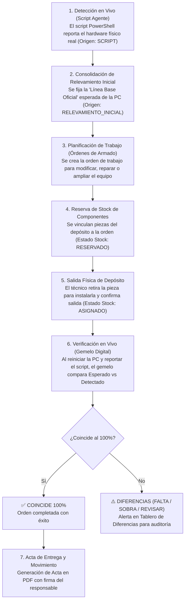

# 🏛️ Arquitectura Visual y Funcional: Modern Guided Card-Based Admin Shell
**Proyecto:** Inventario Modular  
**Poder Judicial de Jujuy - Centro Judicial San Pedro**  
**Fecha de Documentación:** 03 de Septiembre de 2026  

---

## 1. 🎯 Visión General y Propósito

El sistema de **Inventario Modular** resuelve la gestión física y lógica del parque informático mediante el concepto de **Gemelo Digital** (*Digital Twin*).

Para evitar que las pantallas administrativas se conviertan en formularios infinitos, confusos y sin un orden aparente, se diseñó e implementó la arquitectura visual **Modern Guided Card-Based Admin Shell**. Esta arquitectura transforma pantallas tradicionales en un **circuito guiado paso a paso**, donde el usuario siempre comprende:
1. **En qué estado está el equipo actualmente.**
2. **Qué acción acaba de realizar y qué resultado produjo.**
3. **Cuál es el siguiente paso natural a seguir.**

---

## 2. 🔄 El Circuito Operativo Natural (Flujo de Negocio)

El ciclo de vida de un equipo informático dentro del sistema sigue una secuencia lógica estandarizada:

---

## 3. 🎨 Arquitectura Visual: Componentes y Estándares

Toda la interfaz visual se construye sobre Vanilla CSS optimizado en `src/main/resources/static/css/admin.css` utilizando variables y componentes modulares:

### 3.1. Workflow Stepper (`.workflow-stepper`, `.workflow-step`)
- **Propósito:** Mostrar de un solo vistazo el progreso en el circuito operativo.
- **Estados:**
  - `.is-current`: Paso activo que requiere la atención inmediata del usuario (borde primario con sombra azul suave).
  - `.is-done`: Paso completado satisfactoriamente (indicadores verdes y badges autorizados).
- **Estructura Interna:**
  - `.step-header`: Contiene el número `.step-badge` y el estado `.authorization-badge`.
  - `.step-title`: Nombre conciso del paso.
  - `.step-desc`: Breve texto que explica qué significa este paso.
  - `.step-action-area`: Botón de acción rápida conmutador o enlace directo.

### 3.2. Banner de Siguientes Pasos (`.workflow-banner`)
- **Propósito:** Aparece tras realizar una acción clave (ej. consolidar el relevamiento inicial o registrar una orden de armado).
- **Función:** Elimina la sensación de "¿y ahora qué hago?" ofreciendo botones directos a las 2 acciones inmediatamente siguientes (`.workflow-next-actions`).

### 3.3. Pestañas de Navegación Limpia (`.subnav-tabs`, `.subnav-tab`, `.tab-pane`)
- **Propósito:** Evitar el scroll infinito y reducir la fatiga cognitiva.
- **Comportamiento:**
  - Navegación instantánea mediante script liviano Vanilla JS (`switchTab('id')`).
  - Compatible con historial y anclas de URL (`#tab-gemelo`, `#tab-ordenes`, `#tab-editar`, etc.).
  - Cumplimiento de accesibilidad (`role="tab"`, `role="tabpanel"`, `aria-selected`, `aria-controls`).

### 3.4. Grilla de Tarjetas de Hardware (`.attribute-card-grid`, `.attribute-card`)
- **Propósito:** Visualizar la ficha técnica de un equipo dividida en 4 tarjetas compactas:
  1. *Identidad y Red:* Hostname, IP, MAC, Fuero, Ubicación, Usuario asignado.
  2. *Sistema y Procesador:* Sistema Operativo, Arquitectura, CPU, Motherboard.
  3. *Memoria y Almacenamiento:* RAM total, Bancos ocupados, Discos rígidos/SSD con seriales.
  4. *Periféricos y Dispositivos:* Monitores, Teclado, Mouse, Impresora.

### 3.5. Barra de Acciones Rápidas (`.quick-nav-bar`)
- **Propósito:** Barra superior contextual con enlaces cruzados directos:
  - Volver al listado general.
  - Ficha y Gemelo Digital del equipo activo.
  - Acceso al Stock de componentes.
  - Acceso al Tablero General de Diferencias.
  - Historial de Auditoría y Movimientos.

---

## 4. 📂 Mapeo de Archivos y Responsabilidades

| Componente | Archivo Fuente | Descripción |
| :--- | :--- | :--- |
| **Controlador de Equipos** | `ar.gov...web.EquipoPageController.java` | Prepara el modelo de detalle con banderas de relevamiento inicial, conteo de órdenes activas y diferencias del gemelo digital. |
| **Controlador de Armado** | `ar.gov...web.OrdenArmadoPageController.java` | Gestiona el ciclo de vida de las órdenes de ensamble, reserva de piezas de stock (`RESERVADO`) y confirmación física (`ASIGNADO`). |
| **Controlador de Auditoría** | `ar.gov...auditoria.MovimientoEquipoController.java` | Registra traslados de equipos y genera actas de entrega/devolución en formato PDF imprimible. |
| **Servicio de Gemelo Digital** | `ar.gov...componentes.GemeloDigitalService.java` | Compara componentes esperados vs componentes detectados por el script para calcular discrepancias (`COINCIDE`, `FALTA`, `SOBRA`, `REVISAR`). |
| **Estilos CSS Globales** | `src/main/resources/static/css/admin.css` | Contiene todas las definiciones para steppers, banners, pestañas, tablas responsivas y tarjetas. |
| **Plantilla Detalle Equipo** | `src/main/resources/templates/admin/equipo-detalle.html` | Pantalla principal del equipo con stepper de 3 pasos y 4 pestañas. |
| **Plantilla Órdenes Armado** | `src/main/resources/templates/admin/ordenes-armado.html` | Pantalla de órdenes y ensamble con stepper de 4 pasos y 3 pestañas. |
| **Plantilla Listado Equipos** | `src/main/resources/templates/admin/equipos.html` | Listado general con accesos rápidos `[🔍 Gemelo]` y `[🛠️ Órdenes]`. |

---

## 5. 🚀 Hoja de Ruta para la Próxima Jornada de Trabajo

Para continuar mejorando la secuencia natural de pasos desde el puesto de trabajo:

1. **Aplicar el Stepper en la Pantalla de Stock (`/admin/stock`):**
   - *Paso 1:* Ingreso / Recepción de Componentes (alta en inventario con serial y marca).
   - *Paso 2:* Estado en Depósito (disponibilidad física).
   - *Paso 3:* Reserva para Ensamble (vinculado a una orden de armado).
   - *Paso 4:* Asignación Definitiva en Equipo.

2. **Refinar el Tablero de Diferencias (`/admin/dashboard-diferencias`):**
   - Incorporar acciones directas en cada fila con discrepancia:
     - Botón directo *"Crear Orden de Armado para subsanar faltante"*.
     - Botón directo *"Actualizar relevamiento oficial con la nueva lectura"*.

3. **Optimización del Módulo de Actas y Auditoría (`/admin/actas` / `/admin/equipos/{id}/auditoria`):**
   - Integrar la firma digital o código QR de validación en el acta PDF generada con Flying Saucer.
   - Mostrar el histórico de cambios de hardware en una línea de tiempo (*timeline*) visual.

4. **Automatización de Notificaciones o Alertas:**
   - Detectar si un equipo conectado a la red cambió de memoria RAM o disco sin que exista una orden de armado previa (prevención de desvío de hardware).
